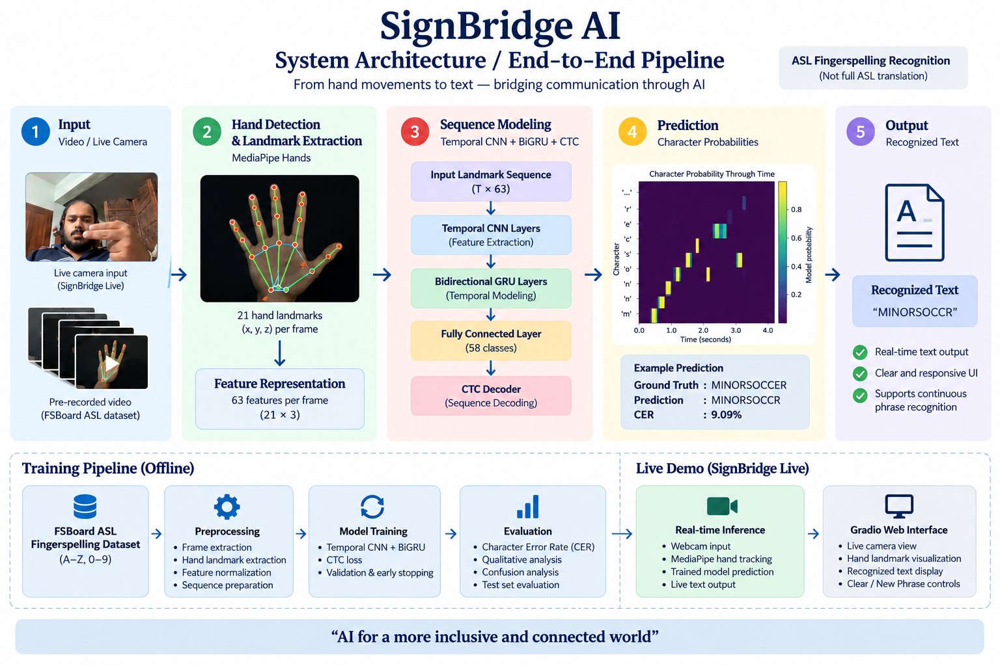
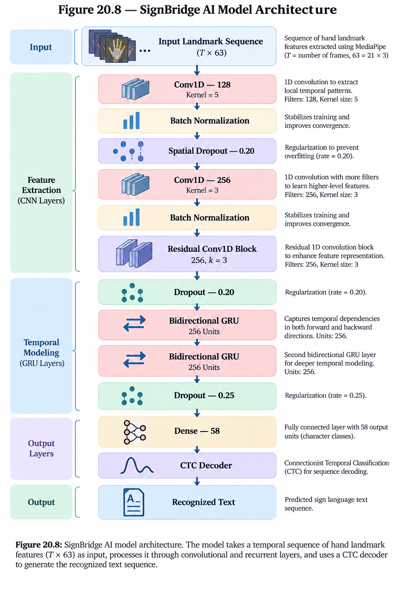
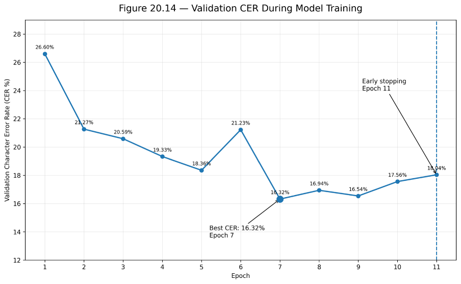
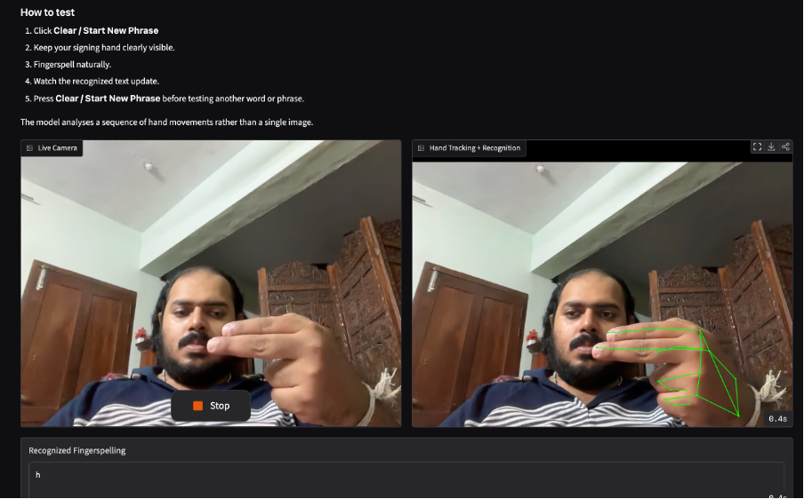
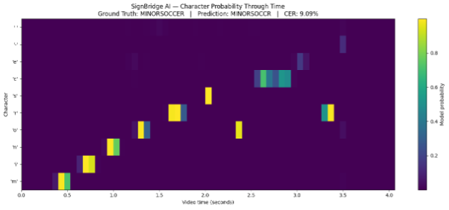

# SignBridge AI

**Real-Time ASL Fingerspelling-to-Text Recognition Using Deep Learning**

SignBridge AI is an accessibility-focused deep-learning project that recognizes continuous **American Sign Language (ASL) fingerspelling** from video and converts it into text.

> **Scope:** SignBridge AI recognizes ASL fingerspelling. It is not a full ASL language-translation system.

## System Architecture



The end-to-end pipeline converts video into a temporal sequence of normalized hand-landmark features, models the sequence with a Temporal CNN and Bidirectional GRU network, and uses CTC decoding to produce text.

```text
Video / Webcam → MediaPipe → 21 × (x,y,z) → T × 63
→ Temporal CNN → BiGRU → Dense 58 → CTC → Text
```

## Model Architecture



The final model combines Temporal Conv1D layers for local motion patterns, batch normalization and dropout, a residual temporal convolution block, two Bidirectional GRU layers for longer sequence context, a 58-output character layer (**57 character classes + CTC blank**), and Connectionist Temporal Classification (CTC) for sequence learning without frame-level character alignment.

The model contains **2,340,410 parameters** (2,339,130 trainable).

## Dataset

The project uses **FSBoard**, a large-scale ASL fingerspelling dataset collected from smartphone video. Dataset videos and processed landmark caches are **not included in this repository**. Users should obtain the dataset through its official distribution channel and comply with its licensing and access requirements.

For the documented processed stage, **1,306 clips** were converted into compact MediaPipe landmark sequences:

- Training: 1,122
- Validation: 140
- Test: 44
- Compressed landmark data: 11.62 MB
- Raw videos retained: 0

## Preprocessing

Each sampled frame is processed with MediaPipe Hand Landmarker. The 21 detected hand landmarks provide x, y and z coordinates, producing **63 numerical features per frame**.

Landmarks are wrist-centered and scaled using the wrist-to-middle-finger MCP distance. Videos are sampled at approximately 12 FPS for preprocessing, with a maximum sequence length of 240 frames. The resulting temporal sequence is supplied to the neural network without temporal downsampling.

## Training & Evaluation

Character Error Rate (CER) is the primary evaluation metric because SignBridge AI performs sequence transcription rather than single-label classification.



Documented results from the later training/evaluation stage:

| Metric | Result |
| --- | ---: |
| Best validation CER | **16.32%** |
| Best epoch | **7** |
| Early stopping | **Epoch 11** |
| Later cached FSBoard test-split CER | **15.96%** |

The best model checkpoint was restored after early stopping. These figures describe the documented experimental setup and should not be treated as a direct apples-to-apples comparison with results obtained using different FSBoard subsets or protocols.

## SignBridge Live

The project includes an interactive **Gradio** prototype for webcam-based fingerspelling recognition. MediaPipe detects and visualizes the hand landmarks while a rolling temporal buffer supplies landmark sequences to the trained model.



The current implementation should be considered a **near-real-time interactive prototype**; a formal end-to-end latency/FPS benchmark has not been performed.

## Diagnostic Example

The following held-out FSBoard diagnostic illustrates how character probabilities evolve through the video sequence.



**Ground truth:** `minorsoccer`  
**Prediction:** `minorsoccr`  
**Sample CER:** 9.09%

This example contains one character deletion and is an illustrative diagnostic sample, **not the full test-set benchmark**.

## Repository Structure

```text
SignBridgeAI/
├── SignBridge_AI_Training_and_Live_Demo.ipynb
├── README.md
├── LICENSE
├── requirements.txt
├── .gitignore
└── assets/
    ├── system_architecture.png
    ├── model_architecture.png
    ├── validation_cer.png
    ├── signbridge_live.png
    └── character_probability_heatmap.png
```

## Run the Project

The main Colab-ready notebook is:

**`SignBridge_AI_Training_and_Live_Demo.ipynb`**

Install the Python dependencies with:

```bash
pip install -r requirements.txt
```

FSBoard data is not bundled with the repository. Configure dataset access separately and provide Kaggle credentials through **Google Colab Secrets or environment variables** rather than hard-coding credentials.

## Main Technologies

Python · TensorFlow/Keras · MediaPipe · OpenCV · NumPy · Pandas · Gradio · Google Colab

## Limitations

Current limitations include:

- Training/evaluation on a project subset rather than the complete FSBoard corpus.
- Dynamic character vocabulary derived from the selected project data rather than a fixed train-only inventory.
- Deterministic subset sampling rather than signer/collection-stratified sampling.
- Single-hand tracking with no handedness canonicalization.
- No face or body landmarks.
- Repeated-character sequences can be difficult under CTC decoding.
- Webcam input introduces domain shift relative to FSBoard recordings.
- Repeated experimental evaluation on cached test subsets can introduce test-set tuning risk.
- The live rolling buffer is limited and the interface uses manual Clear / New Phrase control.

## Security & Repository Hygiene

API keys, access tokens, raw FSBoard videos, processed landmark caches, temporary media, training state and model checkpoints are excluded through `.gitignore`.

The dataset itself is **not distributed under this repository's MIT License**. Third-party datasets and libraries remain subject to their respective licenses and terms.

## Future Work

Potential improvements include training on more data and signers, train-only/fixed vocabulary construction, handedness normalization, stronger decoding or language-model integration, improved repeated-character handling, data augmentation, multimodal landmarks, formal live-latency benchmarking, mobile deployment and text-to-speech output.

## Author

**Koshy Mammoottill Mathew**

Developed as part of the **Certificate Course in Data Science and Artificial Intelligence**.

## Acknowledgements

This project uses the FSBoard ASL fingerspelling dataset and open-source machine-learning and computer-vision libraries. Refer to the project report and original FSBoard publication for academic background and dataset attribution.
